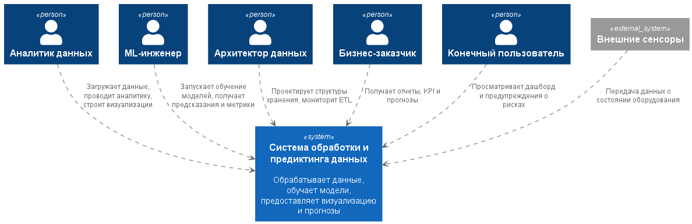
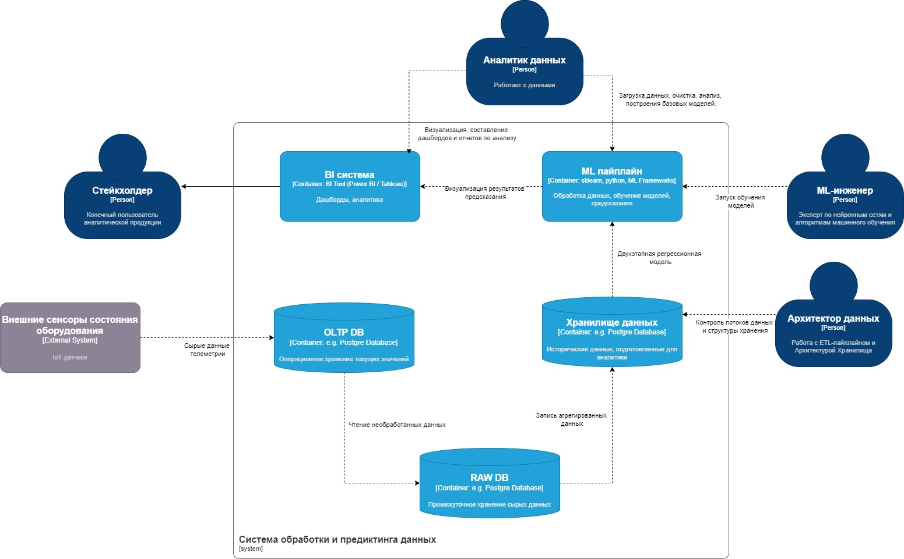
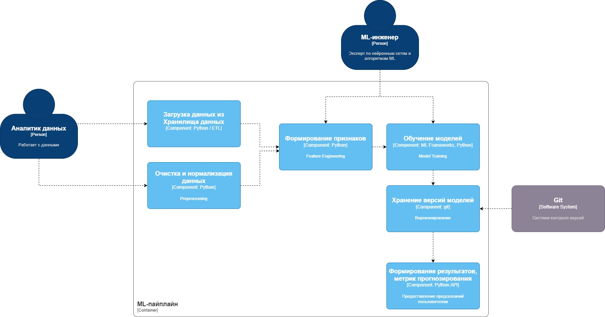

# Лабораторная работа №2
**Тема:** Использование нотации C4 model для проектирования архитектуры программной системы  
**Цель работы:** Получить опыт использования графической нотации для фиксации архитектурных решений.

---

## **1. Диаграмма системного контекста**

---

**Описание:**  
Системный контекст показывает, как внешние пользователи и системы взаимодействуют с нашей системой обработки и предиктинга данных.

**Элементы диаграммы:**

- **Пользователи:**
  - Аналитик данных: загружает, очищает и анализирует данные, строит визуализации.
  - ML-инженер: работает с моделями, подбирает гиперпараметры, запускает предсказания.
  - Архитектор данных: следит за структурой хранения данных, формирует ETL процессы.
  - Бизнес-заказчик: получает аналитические отчеты и прогнозы.
- **Система обработки и предиктинга данных**:
  - Получает данные из OLTP / RAW зон
  - Формирует DWH
  - Выполняет предобработку и агрегирование
  - Запускает ML-пайплайн (Модель А --> Модель Б)
  - Предоставляет результаты пользователям через BI или Python-визуализацию

**Пояснение:** Системный контекст показывает, что наша система взаимодействует как с внешними пользователями, так и с источниками данных, обеспечивая поток информации до конечного результата.

---

## **2. Диаграмма контейнеров**

---

**Описание:**  
Диаграмма контейнеров показывает, как система разбивается на логические блоки, которые разворачиваются независимо и взаимодействуют между собой.

**Контейнеры системы:**

1. **OLTP база данных**
   - Хранит транзакционные данные об оборудовании и событиях
   - Взаимодействует с RAW контейнером для выгрузки данных

2. **RAW зона**
   - Копия данных из OLTP для последующей обработки
   - Обеспечивает историчность данных

3. **DWH контейнер**
   - Факт-таблицы и измерения
   - Отдает агрегированные данные ETL

5. **ML контейнер**
   - Обучение и инференс моделей
   - Сохраняет предсказания в DWH
   - Предсказывает бинарную целевую переменную

6. **BI**
   - Отображает отчет, графики
   - Читает данные из датасета прогнозирования и хранилища

**Выбор архитектурного стиля:**  
- **Микросервисная / распределённая** Архитектура системы представляет собой многослойную data-platform. Каждый контейнер представляет отдельный уровень обработки данных: источник, слой сырых данных, аналитическое хранилище, слой моделирования и слой визуализации.
- **Причины выбора:** Выбрана многослойная архитектура с разделением на OLTP, RAW, DWH, ML и BI, чтобы обеспечить модульность, масштабируемость и управляемость потоков данных. Она позволяет добавлять новые модели и источники данных без переработки существующих компонентов

---

## **3. Диаграмма компонентов для ML-контейнера**

---

**Описание:**  
Диаграмма компонентов ML-контейнера показывает, как внутри контейнера организованы логические модули для подготовки данных, обучения моделей и генерации прогнозов. Она демонстрирует взаимодействие между компонентами, а также связь с актёрами (Аналитик данных, ML-инженер) и внешней системой (Git для хранения версий моделей).  

**Компоненты ML-контейнера:**  

1. **Загрузка и хранилища данных**  
   - Получение данных из DWH

2. **Очистка и нормализация данных**  
   - Обработка пропусков и выбросов  
   - Нормализация и стандартизация признаков  

3. **Формирование признаков**  
   - Создание новых признаков на основе исходных данных  
   - Выбор и фильтрация информативных признаков для моделей  

4. **Обучение моделей**  
   - Обучение регрессионных моделей и многослойного персептрона
   - Настройка гиперпараметров

5. **Хранение версий моделей**  
   - Сохранение моделей в Git 
   - Отслеживание версий и возможность восстановления

6. **Формирование результатов и метрик прогнозирования**  
   - Вычисление метрик качества моделей  
   - Формирование прогнозов и отчетов для BI

**Акторы:**  
- Аналитик данных  
- ML-инженер  

**Внешние системы:**  
- Git  

**Пояснение:**  
- Каждый компонент выполняет отдельную ответственность
- Компонент "Обучение моделей" использует данные, подготовленные модулем очистки и признаков
- Хранение версий моделей позволяет сохранять все изменения моделей для воспроизводимости и контроля