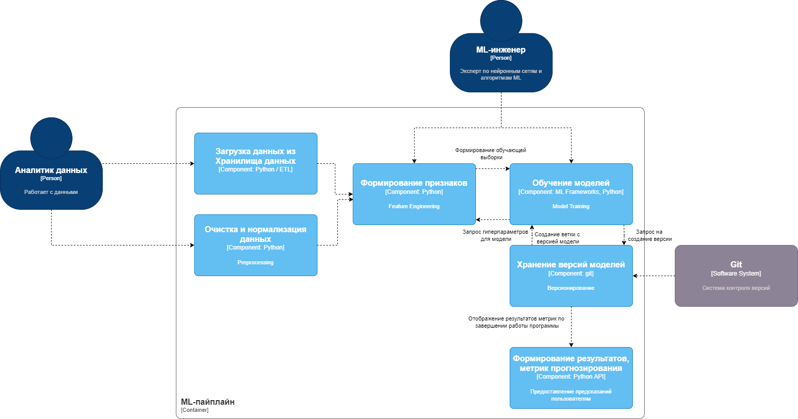
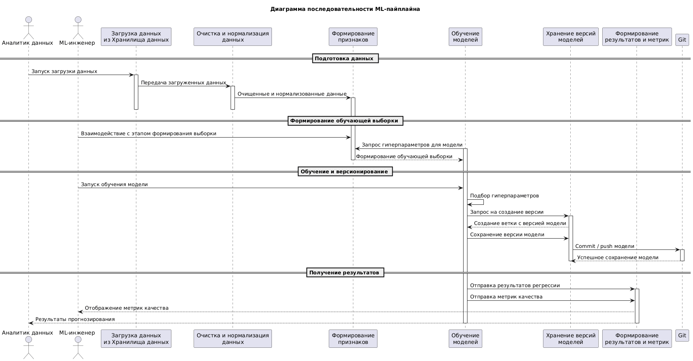
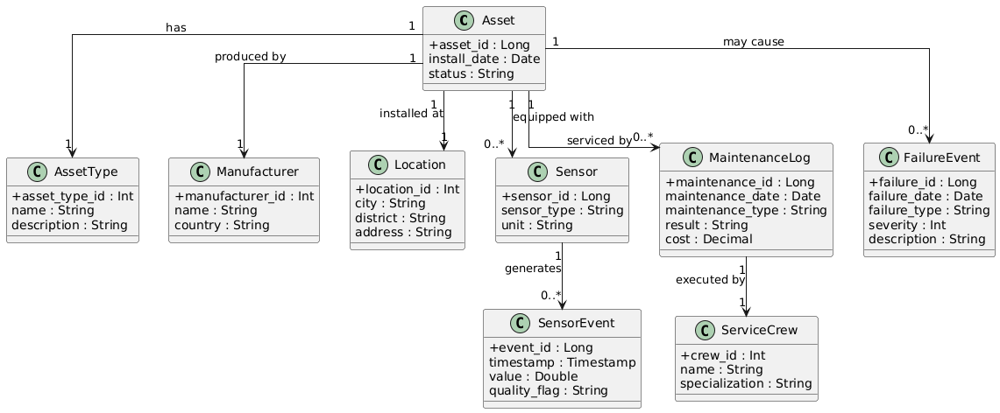

# Лабораторная работа №3

## Тема  
Использование принципов проектирования на уровне методов и классов

## Цель работы  
Получить опыт проектирования и реализации модулей с использованием принципов KISS, YAGNI, DRY, SOLID и других принципов разработки программных систем.

---

## Диаграмма контейнеров


  

---

## Диаграмма компонентов



---

## Диаграмма последовательностей

...



---

## Модель БД

...



---

# Применение основных принципов разработки

---

## В рамках реализации ML-контейнера были применены следующие базовые принципы разработки.

### KISS

**Суть принципа:**  
Решения должны быть максимально простыми и не содержать избыточной сложности.

**Применение в проекте:**  
Каждый этап ML-пайплайна реализован как отдельный модуль с понятным и ограниченным набором методов (загрузка данных, очистка, формирование признаков, обучение моделей, расчет метрик).  
Логика двухэтапного прогнозирования реализована последовательно без объединения этапов в сложные универсальные классы.

---

### YAGNI
**Суть принципа:**  
Не следует реализовывать функциональность, которая не требуется на текущем этапе.

**Применение в проекте:**  
В системе отсутствуют преждевременно реализованные механизмы автоматического деплоя моделей, сложной оркестрации и онлайн-инференса.  
Реализован только необходимый минимум для обучения моделей, оценки качества и сохранения версий, достаточный для учебной и исследовательской задачи.

---

### DRY

**Суть принципа:**  
Каждое знание или логика должны иметь единственное представление в системе.

**Применение в проекте:**  
Общие операции (загрузка данных, валидация, расчёт метрик, логирование) вынесены в переиспользуемые функции и базовые классы.  
Одна и та же логика предобработки и формирования признаков используется как для обучения моделей, так и для расчета прогнозов.

---

### SOLID

**Single Responsibility Principle:**  
Каждый компонент ML-контейнера выполняет строго одну ответственность

**Open/Closed Principle:**  
Система допускает добавление новых моделей или этапов обработки без изменения существующего кода, за счёт расширения классов и конфигураций.

**Liskov Substitution Principle:**  
Различные модели могут использоваться взаимозаменяемо через общий интерфейс обучения и прогнозирования.

**Interface Segregation Principle:**  
Компоненты используют только те интерфейсы, которые им необходимы, без зависимости от избыточных методов.

**Dependency Inversion Principle:**  
Высокоуровневая логика ML-пайплайна зависит от абстракций, а не от конкретных реализаций.

---
# Реализация принципов в коде ML-пайплайна

## model/base.py
```python

from abc import ABC, abstractmethod
import numpy as np

class MLModel(ABC):
    @abstractmethod
    def fit(self, X: np.ndarray, y: np.ndarray) -> None:
        pass

    @abstractmethod
    def predict(self, X: np.ndarray) -> np.ndarray:
        pass
```

## model/linear_model.py

```python
import numpy as np
from model.base import MLModel

class LinearRegressionModel(MLModel):
    def __init__(self):
        self.weights = None

    def fit(self, X: np.ndarray, y: np.ndarray) -> None:
        X_bias = np.c_[np.ones(len(X)), X]
        self.weights = np.linalg.pinv(X_bias.T @ X_bias) @ X_bias.T @ y

    def predict(self, X: np.ndarray) -> np.ndarray:
        X_bias = np.c_[np.ones(len(X)), X]
        return X_bias @ self.weights
```

## data/dataset.py
```python
import numpy as np

class Dataset:
    def __init__(self, X: np.ndarray, y: np.ndarray):
        self.X = X
        self.y = y
```

## services/trainer.py
```python
from model.base import MLModel
from data.dataset import Dataset

class Trainer:
    def __init__(self, model: MLModel):
        self.model = model

    def train(self, dataset: Dataset) -> None:
        self.model.fit(dataset.X, dataset.y)
```

## services/predictor.py
```python
import numpy as np
from model.base import MLModel

class Predictor:
    def __init__(self, model: MLModel):
        self.model = model

    def predict(self, X: np.ndarray) -> np.ndarray:
        return self.model.predict(X)
```

## app.py
```python
import numpy as np
from model.linear_model import LinearRegressionModel
from services.trainer import Trainer
from services.predictor import Predictor
from data.dataset import Dataset

def main():
    X = np.array([[1], [2], [3], [4]])
    y = np.array([2, 4, 6, 8])

    dataset = Dataset(X, y)
    model = LinearRegressionModel()

    trainer = Trainer(model)
    trainer.train(dataset)

    predictor = Predictor(model)
    predictions = predictor.predict(np.array([[5], [6]]))

    print(predictions)

if __name__ == "__main__":
    main()
```

---

## Дополнительные принципы разработки

В рамках повышенной сложности были рассмотрены следующие принципы.

---

### BDUF

**Применимость:** частично применим.

**Обоснование:**  
Предварительное проектирование архитектуры системы (контекст, контейнеры, компоненты) является оправданным, однако детальное проектирование ML-моделей и признаков на старте нецелесообразно из-за экспериментального характера машинного обучения.

---

### SoC

**Применимость:** полностью применим

**Обоснование:**  
Архитектура ML-контейнера построена на строгом разделении ответственности между компонентами обработки данных, обучения моделей и формирования результатов, что повышает сопровождаемость и масштабируемость системы

---

### MVP

**Применимость:** полностью применим

**Обоснование:**  
Реализация минимально жизнеспособной версии ML-пайплайна позволяет проверить бизнес-гипотезу предсказания отказов оборудования без избыточных затрат на инфраструктуру и автоматизацию

---

### PoC

**Применимость:** полностью применим на начальном этапе

**Обоснование:**  
PoC используется для проверки технической реализуемости двухэтапной модели прогнозирования и оценки качества результатов до перехода к более стабильной и расширяемой реализации

---