# Лабораторная работа №4

## Тема
Проектирование REST API

## Цель работы
Получить опыт проектирования программного интерфейса.
---

## Документация по API

### Общее описание API

Проектируемый REST API предназначен для взаимодействия с подсистемой обработки и предиктинга данных.  
API предоставляет возможность:
- получать данные из хранилища;
- запускать обучение ML-моделей;
- получать прогнозы и метрики качества;
- управлять версиями моделей.

API реализуется в виде отдельного сервисного слоя и использует формат данных **JSON**.  
Базовый URL API: /api/v1


---

## Описание Endpoints

---

### 1. Получение списка датасетов

**Метод:** `GET`  
**Endpoint:** `/datasets`

**Описание:**  
Возвращает список доступных датасетов, подготовленных и сохранённых в хранилище данных.

**Параметры запроса:**  
Отсутствуют.

**Формат ответа:**

```json
[
  {
    "dataset_id": 1,
    "name": "sensor_data_2024",
    "rows_count": 250000,
    "created_at": "2024-11-01T10:15:00"
  }
]
```

**Коды:**
- Успешный код: 200 OK (возвращает список, даже если он пустой)

### 2. Получение датасета по идентификатору

**Метод:** `GET`
**Endpoint:** `/datasets/{dataset_id}`

**Описание:**
Возвращает метаданные и краткое описание выбранного датасета.

**Path-параметры:**
- `dataset_id` — идентификатор датасета (integer)

**Формат ответа:**
```json
{
  "dataset_id": 1,
  "name": "sensor_data_2024",
  "columns": ["timestamp", "sensor_id", "value", "health_score"],
  "rows_count": 250000
}
```

**Коды:**
- Успешный код: 200 OK
- Ошибка: 404 Not Found (если dataset_id не существует)

### 3. Запуск обучения ML-модели

**Метод:** `POST`
**Endpoint:** `/models/train`

**Описание:**
Запускает процесс обучения ML-модели на выбранном датасете.
Поддерживается двухэтапная модель:
- прогноз health_score;
- прогноз бинарной переменной is_failure.

**Тело запроса:**
```json
{
  "dataset_id": 1,
  "model_type": "random_forest",
  "target": "health_score"
}
```

**Формат ответа:**

```json
{
  "training_id": "train_202",
  "status": "started",
  "message": "Model training started"
}
```

**Коды:**
- Успешный код: 202 Accepted (лучше, чем 201, так как обучение запущено, но еще не завершено)
- Ошибка: 400 Bad Request (некорректные параметры)
- Ошибка: 404 Not Found (dataset_id не существует)

### 4. Получение списка обученных моделей

**Метод:** `GET`
**Endpoint:** `/models`

**Описание:**
Возвращает список доступных моделей и их версий.

**Формат ответа:**
```json
[
  {
    "model_id": 10,
    "model_type": "random_forest",
    "target": "health_score",
    "version": "v1.2",
    "created_at": "2024-11-03T14:00:00"
  }
]
```

**Коды:**
- Успешный код: 200 OK

### 5. Получение метрик качества модели

**Метод:** `GET`
**Endpoint:** `/models/{model_id}/metrics`

**Описание:**
Возвращает метрики качества обученной модели.

**Path-параметры:**
- `model_id` — идентификатор модели (integer)

**Формат ответа:**
```json
{
  "model_id": 10,
  "metrics": {
    "rmse": 0.42,
    "mae": 0.31,
    "accuracy": 0.87
  }
}
```

**Коды:**
- Успешный код: 200 OK
- Ошибка: 404 Not Found (если модель не существует или метрики не рассчитаны)

### 6. Получение прогнозов модели

**Метод:** `GET`
**Endpoint:** `/predictions/{model_id}`

**Описание:**
Возвращает результаты прогнозирования выбранной модели.

**Path-параметры:**
- `model_id` — идентификатор модели (integer)

**Формат ответа:**
```json
{
  "model_id": 10,
  "predictions": [
    {
      "asset_id": 101,
      "health_score": 0.82,
      "is_failure": false
    }
  ]
}
```

**Коды:**
- Успешный код: 200 OK
- Ошибка: 404 Not Found (если модель не существует или прогнозы не готовы)

### 7. Обновление метаданных модели (повышенная сложность)

**Метод:** `PUT`
**Endpoint:** `/models/{model_id}`

**Описание:**
Обновляет описание или статус модели.

**Тело запроса (JSON):**
```json
{
  "description": "Updated model after retraining",
  "status": "active"
}
```

**Формат ответа:**

```json
{
  "message": "Model updated successfully"
}
```

**Коды:**
- Успешный код: 200 OK (или 204 No Content, если не возвращаем тело)
- Ошибка: 400 Bad Request (некорректные данные)
- Ошибка: 404 Not Found (модель не существует)

### 8. Удаление модели (повышенная сложность)

**Метод:** `DELETE`
**Endpoint:** `/models/{model_id}`

**Описание:**
Удаляет модель и связанные с ней артефакты.

**Формат ответа (JSON):**
```json
{
  "message": "Model deleted successfully"
}
```

**Коды:**
- Успешный код: 200 OK (или 204 No Content)
- Ошибка: 404 Not Found (модель не существует)

## Форматы данных и соглашения

- Все запросы и ответы используют формат JSON
- Кодировка: UTF-8
- HTTP-коды ответа:
  - `200 OK` — успешный запрос
  - `201 Created` — ресурс создан
  - `400 Bad Request` — ошибка запроса
  - `404 Not Found` — ресурс не найден
  - `500 Internal Server Error` — внутренняя ошибка сервиса


## Тестирование API

### GET /api/v1/datasets

- Запрос:

---

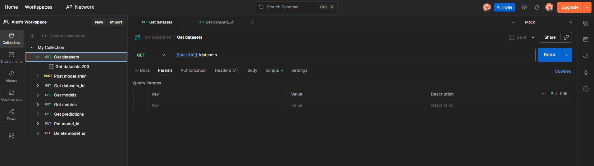

---

- Код 200:

---

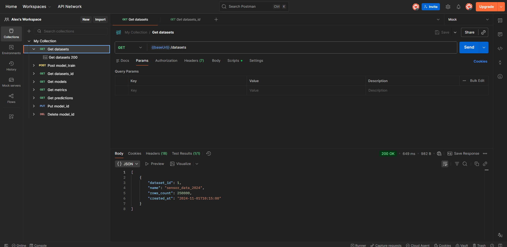

---

### GET /api/v1/datasets/{dataset_id}

- Запрос:

---

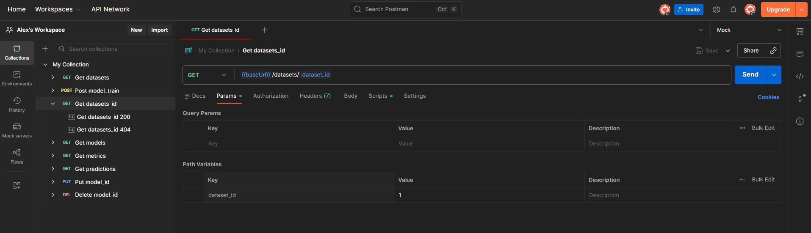

---

- Код 200:

---

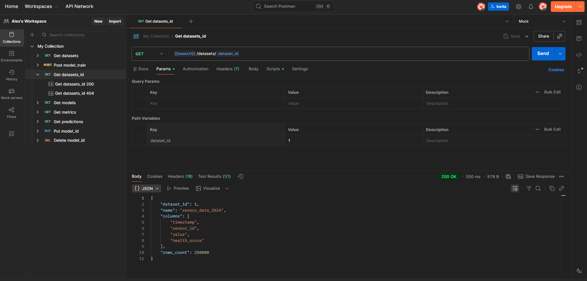

---

- Код 404:

---

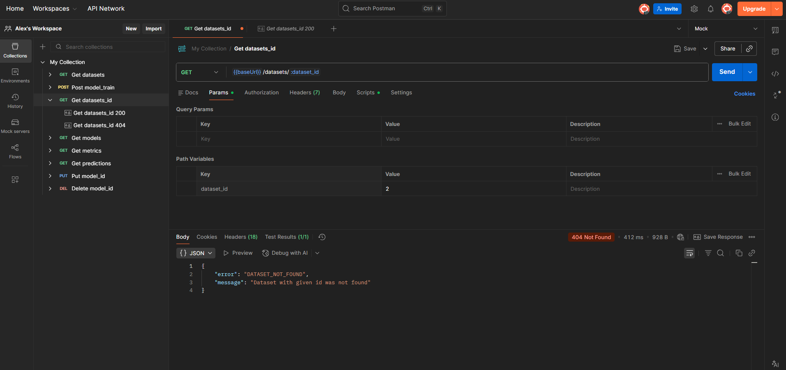

---

### POST /api/v1/models/train

- Запрос:

---

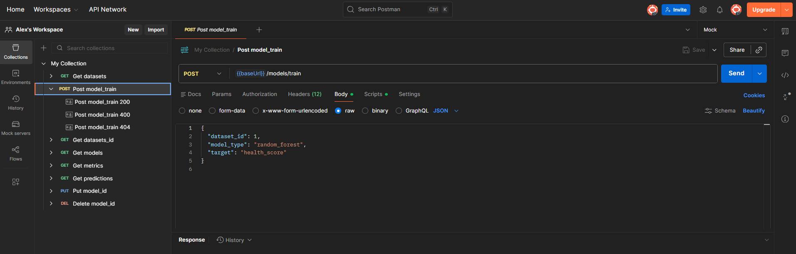

---

- Код 200:

---

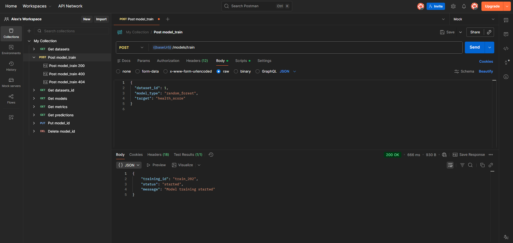

---

- Код 400:

---

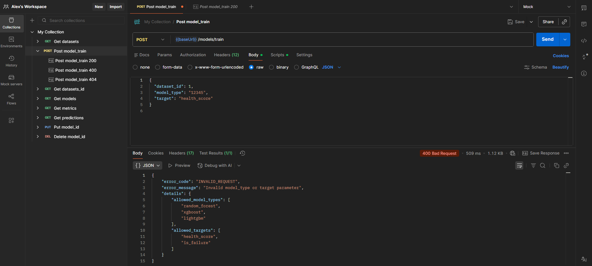

---

- Код 404:

---

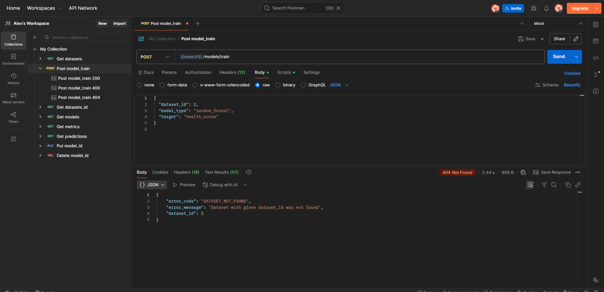

---

### GET /api/v1/models

- Запрос:

---

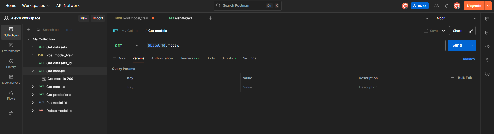

---

- Код 200:

---

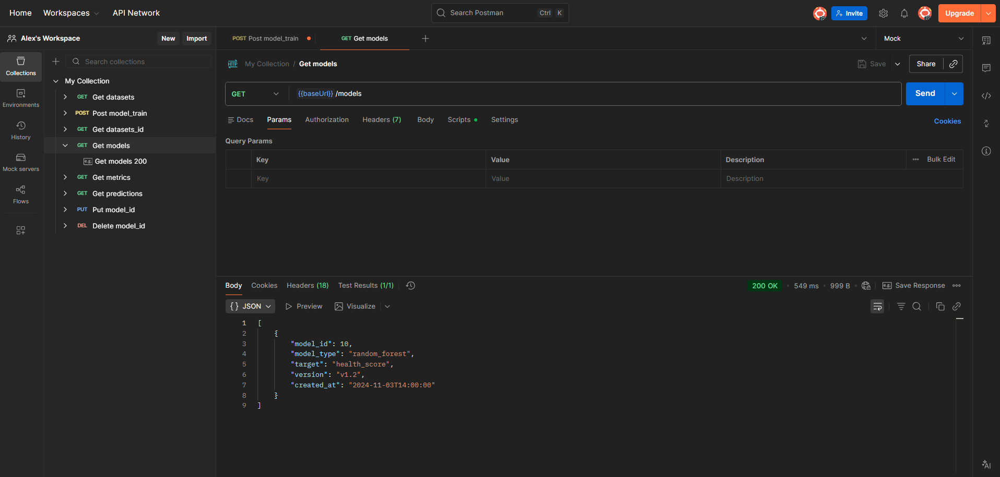

---

### GET /api/v1/models/{model_id}/metrics

- Запрос:

---

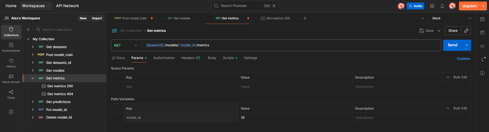

---

- Код 200:

---

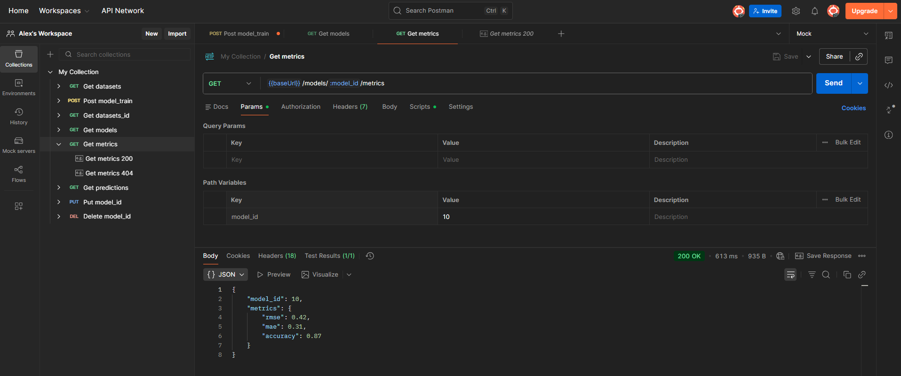

---

- Код 404:

---


---

### GET /api/v1/predictions/{model_id}

- Запрос:

---


---

- Код 200:

---

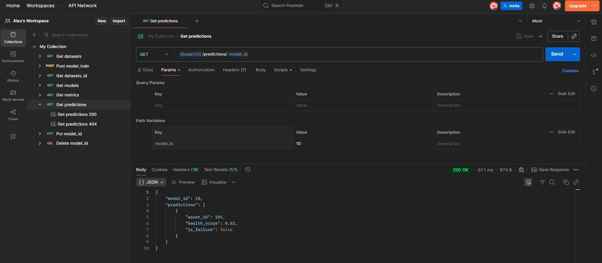

---

- Код 404:

---

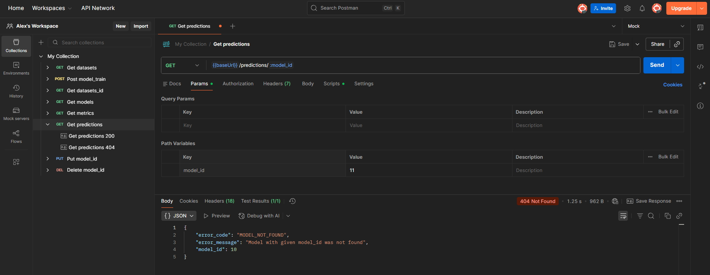

---

### PUT /api/v1/models/{model_id}

- Запрос:

---

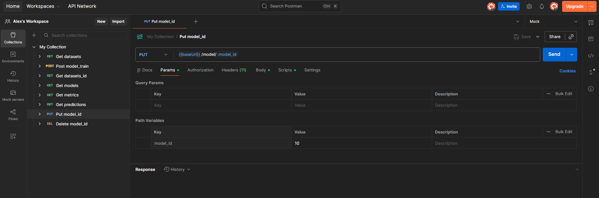

---

- Код 200:

---

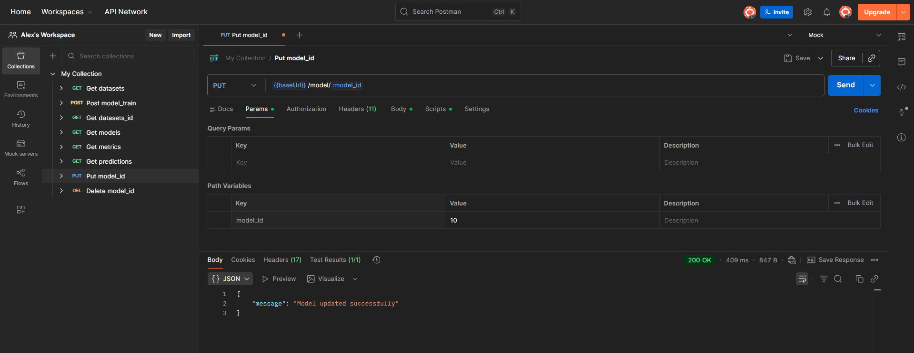

---

- Код 400:

---

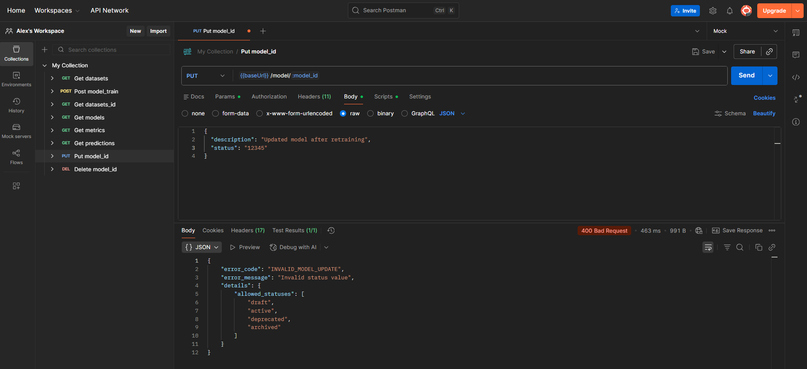

---

- Код 404:

---

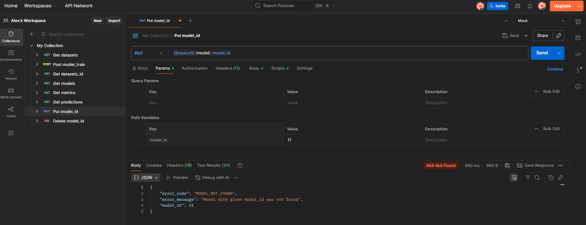

---

### DELETE /api/v1/models/{model_id}

- Запрос:

---


---

- Код 200:

---

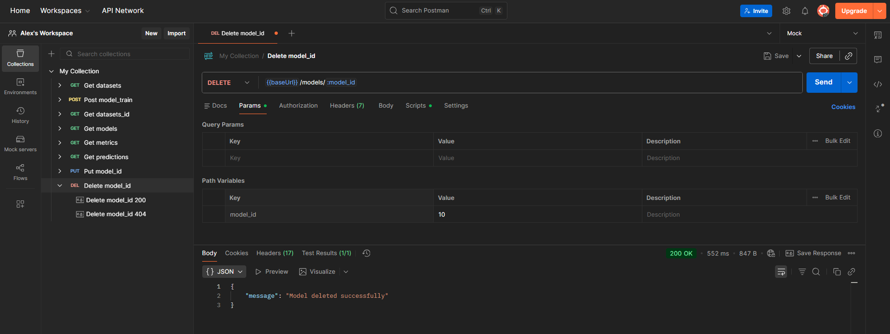

---

- Код 404:

---

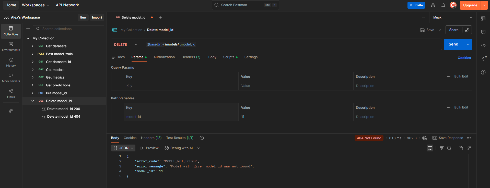

---